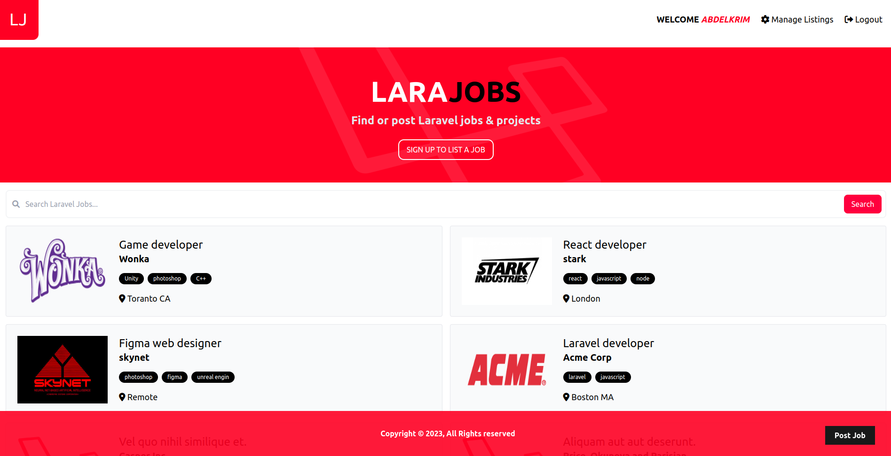

	<h1>Laravel Job Listings Website
	 
		
		
		
        
		 
	</h1>

## 📝 Description

full-stack CRUD Laravel application for job Listings with registration, login, post ownership, and listings management page.  
-Builed with PHP Laravel Framework. 
-styled with Tailwind CSS. 
-MySql for the database. 

## 🛠️ Built with

- PHP 
- laravel 
- Tailwind CSS 
- My Sql 